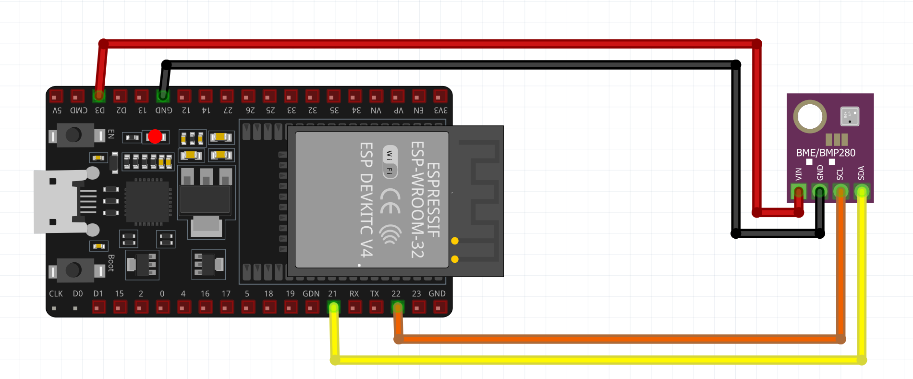
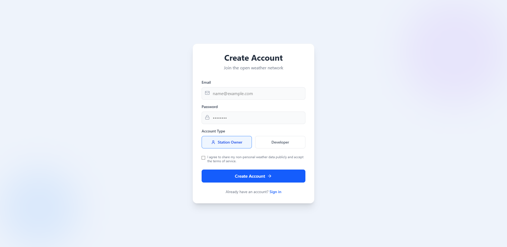
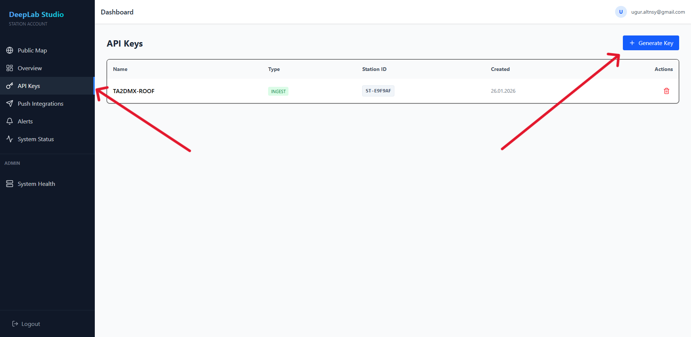
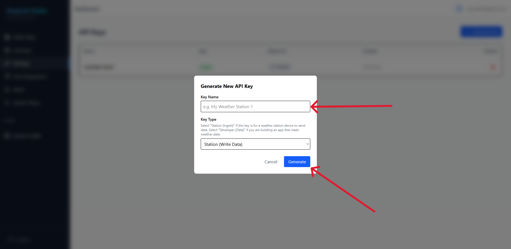
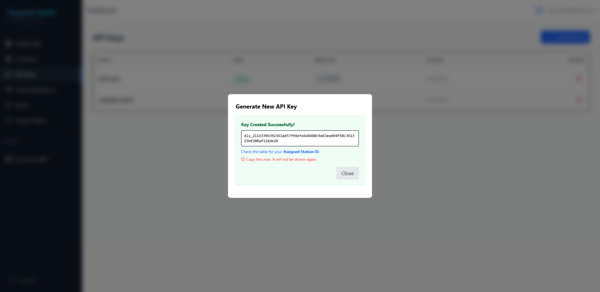
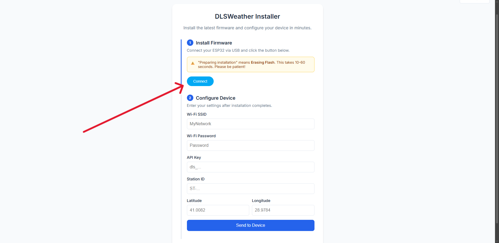
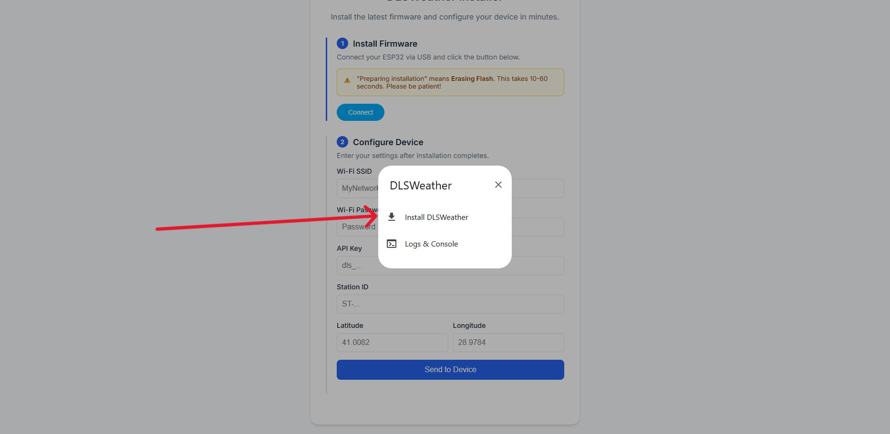
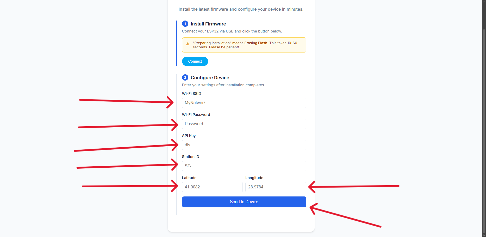

# 🌦️ DLS Weather Node

The purpose of this project is to support the **DLS Weather** initiative by enabling the deployment of **community-driven weather nodes**.

With this service, collected weather data can be transmitted **for free to up to 5 different platforms simultaneously** through a **single API**.

Supported platforms:

- 📡 **APRS Weather Station** (for amateur radio operators)
- 🌍 **PWSWeather**
- ☁️ **WeatherCloud**
- 🌡️ **Weather Underground**
- 🌬️ **Windy.com**

---

## 🔌 Supported Hardware

The DLS Weather Node is designed to work with various ESP32 boards, sensors, and displays. Below is the list of supported and tested hardware.

### 📟 Supported Devices

| Device Name | Chip | Tested | Notes |
| :--- | :--- | :---: | :--- |
| **Standard ESP32** | ESP32-WROOM | ✅ | Classic ESP32 |
| **SuperMini ESP32-C3** | ESP32-C3 | ✅ | Recommended Board (Low Power, Compact) |
| **ESP32-S3** | ESP32-S3 | ❌ | High Performance, AI Features |

### 🌡️ Supported Sensors

| Sensor | Type | Tested | Measurements |
| :--- | :--- | :---: | :--- |
| **BMP280** | I2C | ✅ | Temperature, Pressure |
| **BME280** | I2C | ✅ | Temperature, Humidity, Pressure |
| **BME680** | I2C | ✅ | Temperature, Humidity, Pressure, Gas (IAQ) |
| **SHTC3** | I2C | ❌ | Temperature, Humidity |
| **SHT31** | I2C | ✅ | Temperature, Humidity |
| **SHT35** | I2C | ❌ | Temperature, Humidity |
| **VEML6075** | I2C | ❌ | UV Index (Supported in code, not verified) |
| **BH1750** | I2C | ❌ | Light Level (Planned) |

### 📺 Supported Displays

| Display Controller | Size | Tested | Interface |
| :--- | :--- | :---: | :--- |
| **SSD1306** | 1.3" OLED | ✅ | I2C |
| **SH1106** | 1.3" OLED | ✅ | I2C |

## 

## 🔑 Getting an API Key

### 1️⃣ Step – Register

👉 [https://wx.deeplabstudio.com/register](https://wx.deeplabstudio.com/register)\


### 2️⃣ Step – Go to the API Keys Page

👉 [https://wx.deeplabstudio.com/dashboard/api-keys](https://wx.deeplabstudio.com/dashboard/api-keys)\


### 3️⃣ Step – Generate a New Key

Click on the `+ Generate Key` button.\


### 4️⃣ Step – Copy the API Key

Copy and securely store your generated API key.\


---

## ⚙️ Installing DLS Weather Node on ESP32

### 1️⃣ Step – Open DLS Weather Installer

👉 [https://deeplab-studio.github.io/DLS-Weather-Node/](https://deeplab-studio.github.io/DLS-Weather-Node/)\


### 2️⃣ Step – Connect and Install

- Click **Connect**
- Select **Install DLSWeather**\
  

### 3️⃣ Step – Configure Settings

After installation, configure:

- Wi-Fi credentials
- API Key
- Sensor settings\
  

### 4️⃣ Step – Verify on Website

You can monitor your node from the web dashboard: 👉 [https://wx.deeplabstudio.com/](https://wx.deeplabstudio.com/)

---

## 🔗 Using DLS Weather API in Other Projects

The DLS Weather API is open for integration with your own projects.

### API Endpoint

```
POST https://wx-api.deeplabstudio.com/v1/ingest/weather
```

### Required Headers

```
Content-Type: application/json
x-api-key: <api_key>
```

### Example Payload

```json
{
  "stationId": "ST-E9F9AF",
  "timestamp": 1769449600,
  "location": {
    "lat": 0.0,
    "lon": 0.0
  },
  "environment": {
    "temperature": 22.5,      // Optional
    "humidity": 60,           // Optional
    "pressure": 1013,         // Optional
    "uv_index": 3.5,          // Optional
    "air_quality": 45         // Optional
  },
  "wind": {
    "speed": 5.2,             // Optional
    "direction": 180          // Optional
  },
  "rain": {
    "rate": 0,                // Optional
    "daily": 2.5              // Optional
  }
}
```

---

## 🤝 Contribution & Support

This is a community-driven project. Feel free to contribute, deploy nodes, or share feedback to help improve the DLS Weather ecosystem.

📡 **DLS Weather – Community Powered Weather Data Network**
